<div align="center">


# E&J PRO Soluções

**Sistema web de gestão para oficina de refrigeração automotiva**

Clientes, veículos e ordens de serviço em um só lugar, com impressão da OS e cobrança via PIX com QR Code.

<br />


<br />

[Visão geral](#-visão-geral) •
[Funcionalidades](#-funcionalidades) •
[Telas](#-telas-do-sistema) •
[Como funciona](#-como-funciona) •
[Arquitetura](#-arquitetura) •
[Instalação](#-como-rodar-o-projeto) •
[Docker](#-docker) •
[Dicas](#-dicas-de-uso)

<br />

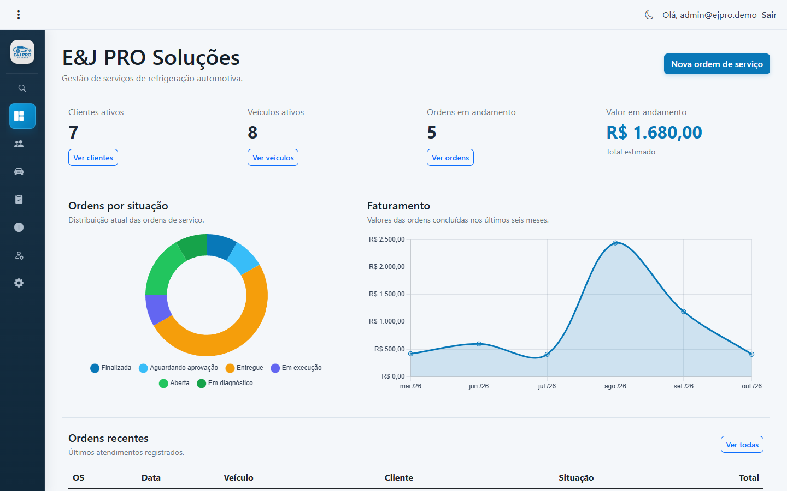

</div>

<br />

## 📌 Visão geral

O **E&J PRO** nasceu para tirar a oficina do caderno e da planilha. Ele organiza o atendimento desde a chegada do carro até a entrega, mostrando em tempo real quanto dinheiro está parado em serviços abertos e quanto a oficina faturou nos últimos meses.

A ideia é simples: cadastrar o cliente, vincular o veículo, abrir a ordem de serviço e acompanhar cada etapa até a entrega. Na hora de cobrar, a OS sai impressa (ou em PDF) com um QR Code PIX já preenchido com o valor exato do serviço.

| | |
|---|---|
| 👥 **Para quem** | Oficinas de pequeno e médio porte, com foco em refrigeração automotiva |
| 🎯 **Problema que resolve** | Controle de serviços em papel, perda de histórico do veículo e cobrança manual |
| 💡 **Diferencial** | OS pronta para impressão com PIX copia e cola e QR Code gerados na hora |
| 🌗 **Interface** | Responsiva, com tema claro e escuro e menu lateral recolhível |

<br />

## ✨ Funcionalidades

<table>
<tr>
<td width="50%" valign="top">

### 📊 Painel
- Total de clientes e veículos ativos
- Quantidade e valor das ordens em andamento
- Gráfico de ordens por situação
- Gráfico de faturamento dos últimos 6 meses
- Lista das ordens mais recentes

### 👤 Clientes
- Cadastro com CPF (11 dígitos) ou CNPJ (14 dígitos)
- Telefone, e-mail, endereço e observações
- Exclusão lógica: o cliente é inativado e o histórico fica preservado

### 🚗 Veículos
- Placa, marca, modelo, ano, cor, quilometragem e chassi
- Cada veículo pertence a um cliente
- Atalho para abrir uma OS direto do veículo

</td>
<td width="50%" valign="top">

### 🧾 Ordens de serviço
- Problema relatado, diagnóstico e serviço executado
- Mão de obra, peças, desconto e total calculado
- Sete situações, da abertura até a entrega
- Pesquisa por número da OS, placa, marca, modelo ou cliente
- Filtro por situação e paginação de 10 em 10
- Data de conclusão registrada automaticamente

### 🖨️ Impressão e PIX
- OS formatada para caber em uma página A4
- Dados da oficina e logotipo no cabeçalho
- QR Code PIX e código copia e cola com o valor da OS
- Campos de assinatura do responsável e do cliente

### 🔐 Acesso
- Login obrigatório em todas as telas
- Perfis **Administrador** e **Usuário**
- Política de senha forte e bloqueio após tentativas erradas

</td>
</tr>
</table>

<br />

## 🖼️ Telas do sistema

> As telas abaixo foram capturadas com dados fictícios, criados só para demonstração.

### Acesso e painel

<table>
<tr>
<td width="50%">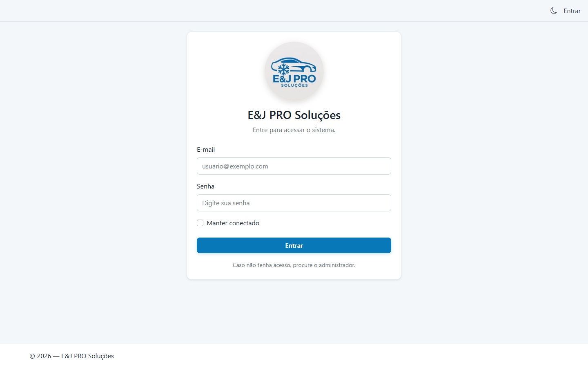</td>
<td width="50%">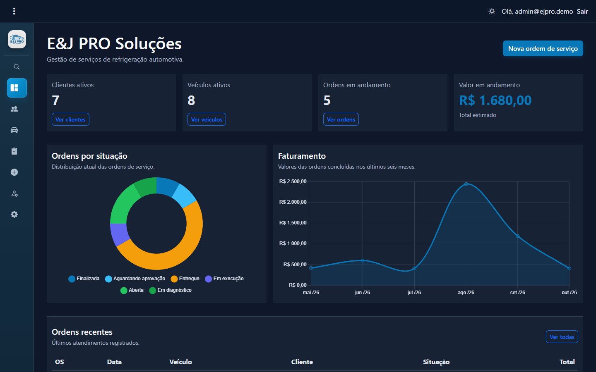</td>
</tr>
<tr>
<td align="center"><sub><b>Login</b></sub></td>
<td align="center"><sub><b>Painel no tema escuro</b></sub></td>
</tr>
</table>

### Ordens de serviço

<table>
<tr>
<td width="50%">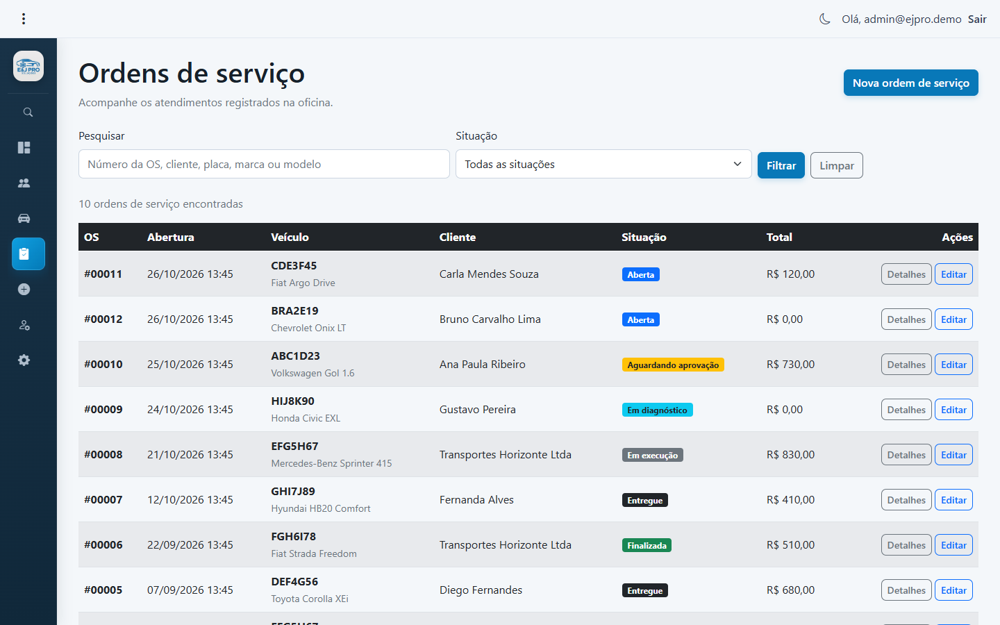</td>
<td width="50%">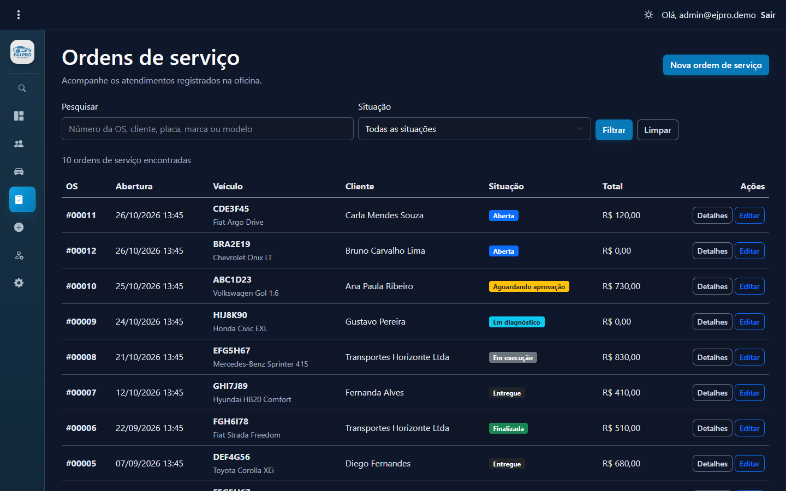</td>
</tr>
<tr>
<td align="center"><sub><b>Lista com pesquisa, filtro e situação colorida</b></sub></td>
<td align="center"><sub><b>A mesma lista no tema escuro</b></sub></td>
</tr>
<tr>
<td width="50%">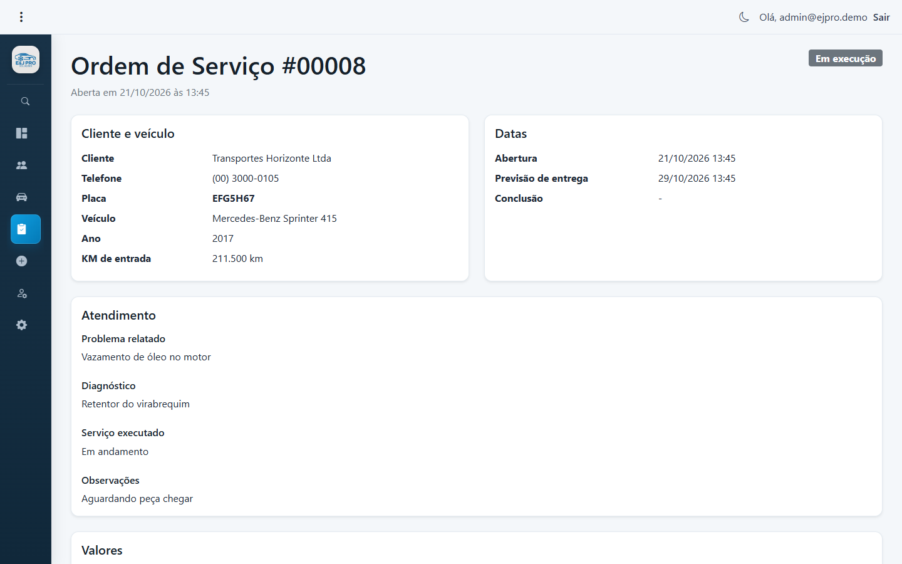</td>
<td width="50%">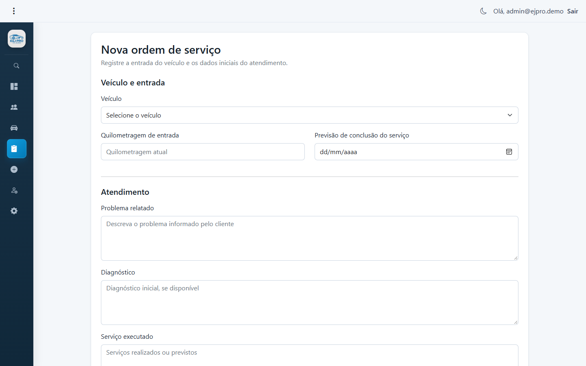</td>
</tr>
<tr>
<td align="center"><sub><b>Detalhes da OS</b></sub></td>
<td align="center"><sub><b>Abertura de uma nova OS</b></sub></td>
</tr>
</table>

### Impressão com PIX

<div align="center">
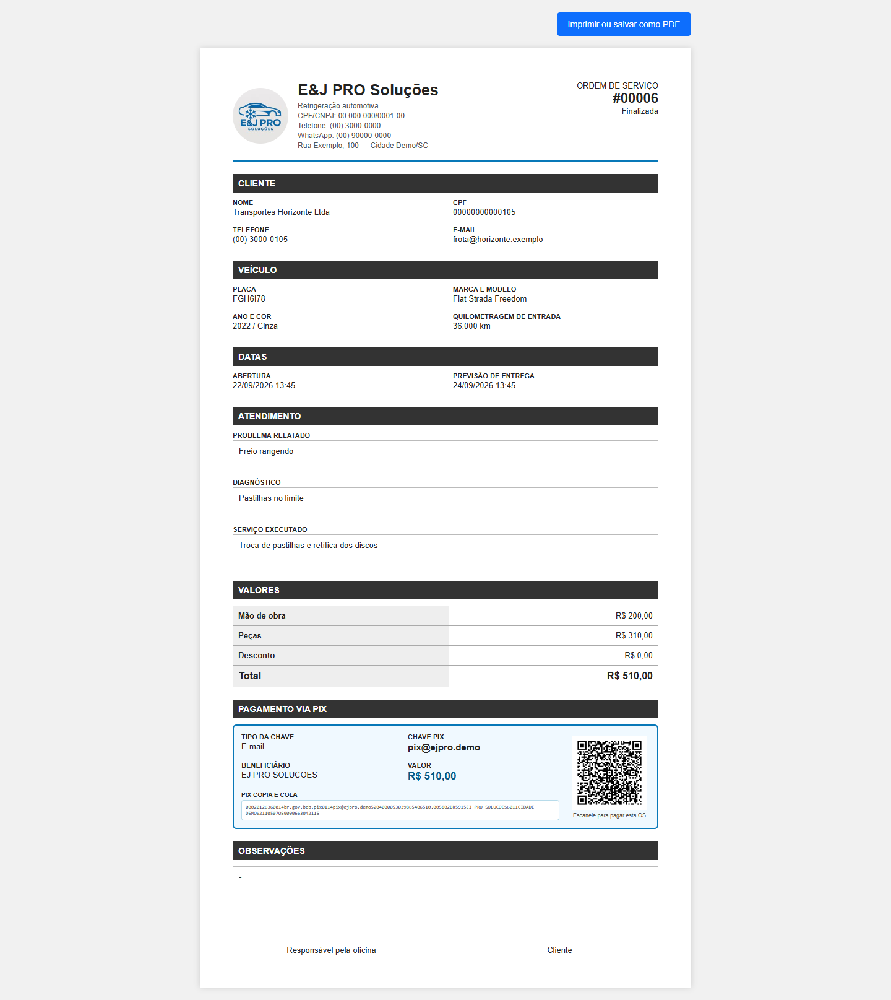
<br />
<sub><b>OS pronta para imprimir ou salvar em PDF, com QR Code PIX no valor do serviço</b></sub>
</div>

<br />

<details>
<summary><b>📂 Ver mais telas</b></summary>
<br />

<table>
<tr>
<td width="50%">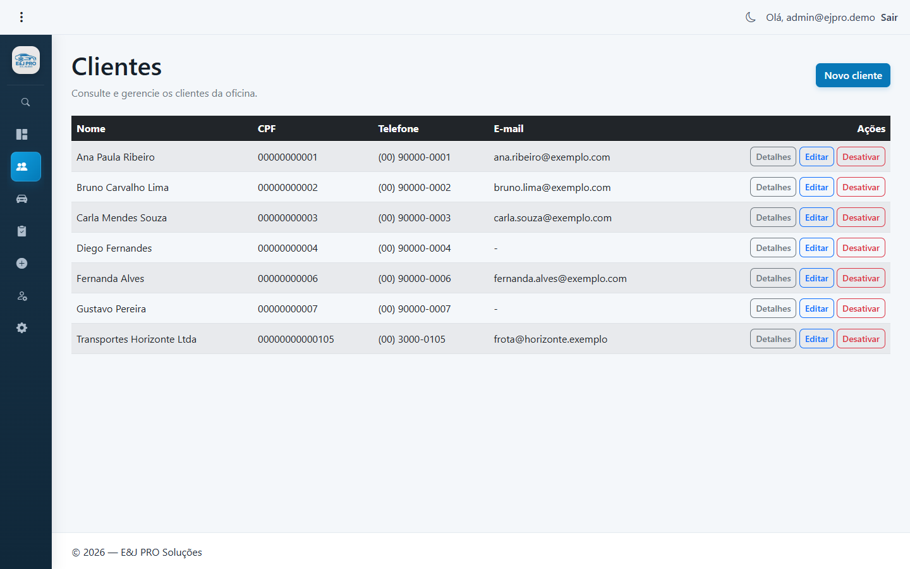</td>
<td width="50%">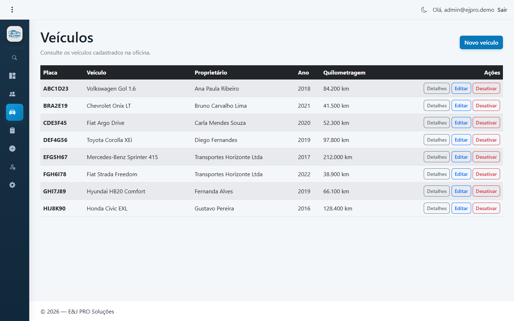</td>
</tr>
<tr>
<td align="center"><sub><b>Clientes</b></sub></td>
<td align="center"><sub><b>Veículos</b></sub></td>
</tr>
<tr>
<td width="50%">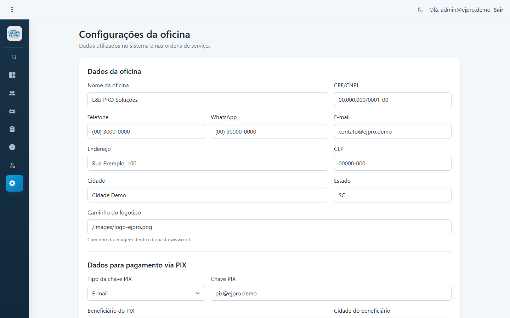</td>
<td width="50%">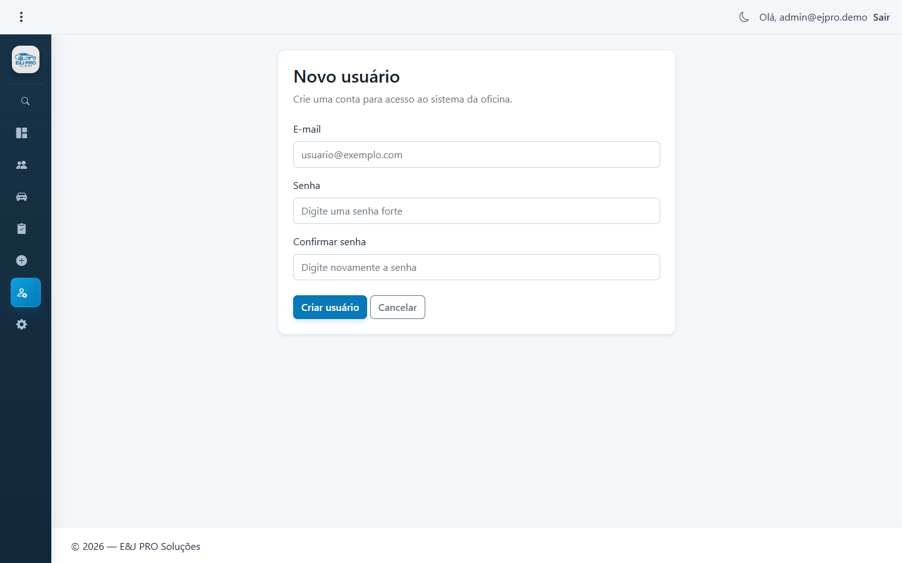</td>
</tr>
<tr>
<td align="center"><sub><b>Configurações da oficina e do PIX</b></sub></td>
<td align="center"><sub><b>Cadastro de novo usuário</b></sub></td>
</tr>
<tr>
<td width="50%">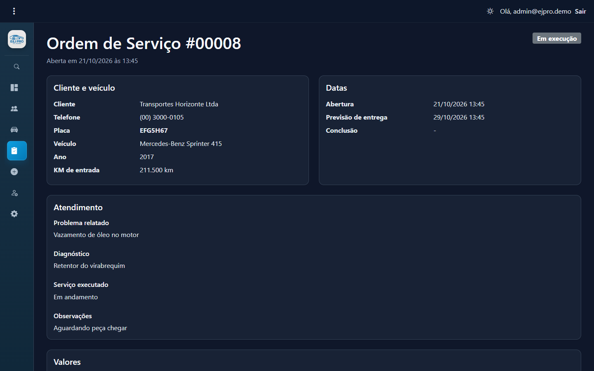</td>
<td width="50%"></td>
</tr>
<tr>
<td align="center"><sub><b>Detalhes da OS no tema escuro</b></sub></td>
<td align="center"><sub><b>Painel no tema claro</b></sub></td>
</tr>
</table>

</details>

<br />

## 🔄 Como funciona

### Jornada do atendimento

Do momento em que o cliente chega até o pagamento, este é o caminho dentro do sistema:

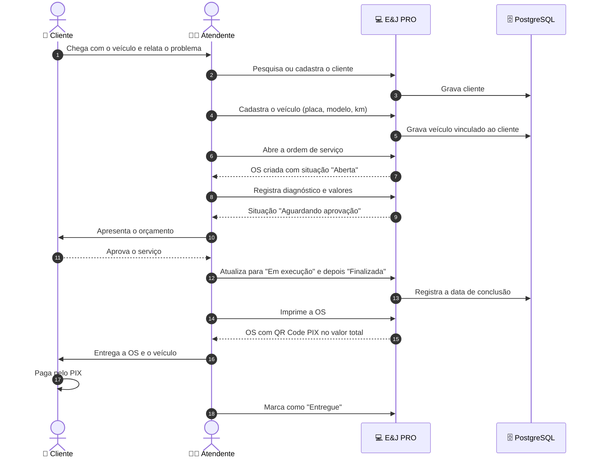
```mermaid
sequenceDiagram
    autonumber
    actor C as 🙋 Cliente
    actor A as 🧑‍🔧 Atendente
    participant S as 💻 E&J PRO
    participant DB as 🗄️ PostgreSQL

    C->>A: Chega com o veículo e relata o problema
    A->>S: Pesquisa ou cadastra o cliente
    S->>DB: Grava cliente
    A->>S: Cadastra o veículo (placa, modelo, km)
    S->>DB: Grava veículo vinculado ao cliente
    A->>S: Abre a ordem de serviço
    S-->>A: OS criada com situação "Aberta"
    A->>S: Registra diagnóstico e valores
    S-->>A: Situação "Aguardando aprovação"
    A->>C: Apresenta o orçamento
    C-->>A: Aprova o serviço
    A->>S: Atualiza para "Em execução" e depois "Finalizada"
    S->>DB: Registra a data de conclusão
    A->>S: Imprime a OS
    S-->>A: OS com QR Code PIX no valor total
    A->>C: Entrega a OS e o veículo
    C->>C: Paga pelo PIX
    A->>S: Marca como "Entregue"
```

### Ciclo de vida da ordem de serviço

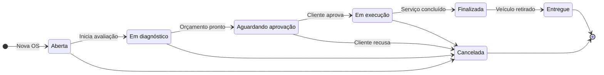
```mermaid
stateDiagram-v2
    direction LR
    [*] --> Aberta: Nova OS
    Aberta --> EmDiagnostico: Inicia avaliação
    EmDiagnostico --> AguardandoAprovacao: Orçamento pronto
    AguardandoAprovacao --> EmExecucao: Cliente aprova
    EmExecucao --> Finalizada: Serviço concluído
    Finalizada --> Entregue: Veículo retirado
    Entregue --> [*]

    Aberta --> Cancelada
    EmDiagnostico --> Cancelada
    AguardandoAprovacao --> Cancelada: Cliente recusa
    EmExecucao --> Cancelada
    Cancelada --> [*]

    EmDiagnostico: Em diagnóstico
    AguardandoAprovacao: Aguardando aprovação
    EmExecucao: Em execução
```

| Situação | Conta como "em andamento" no painel | Entra no faturamento | Data de conclusão |
|---|:---:|:---:|:---:|
| Aberta | ✅ | | |
| Em diagnóstico | ✅ | | |
| Aguardando aprovação | ✅ | | |
| Em execução | ✅ | | |
| Finalizada | | ✅ | preenchida |
| Entregue | | ✅ | preenchida |
| Cancelada | | | limpa |

> [!NOTE]
> O diagrama mostra o caminho natural do atendimento. Na edição da OS a situação pode ser trocada livremente, então a oficina consegue corrigir um lançamento errado sem burocracia.

### Como o PIX da OS é gerado

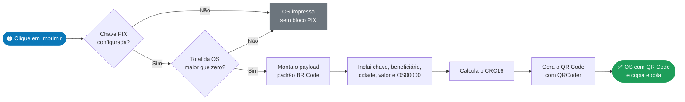
```mermaid
flowchart LR
    A([🖨️ Clique em Imprimir]) --> B{Chave PIX<br/>configurada?}
    B -- Não --> X[OS impressa<br/>sem bloco PIX]
    B -- Sim --> C{Total da OS<br/>maior que zero?}
    C -- Não --> X
    C -- Sim --> D[Monta o payload<br/>padrão BR Code]
    D --> E[Inclui chave, beneficiário,<br/>cidade, valor e OS00000]
    E --> F[Calcula o CRC16]
    F --> G[Gera o QR Code<br/>com QRCoder]
    G --> H([✅ OS com QR Code<br/>e copia e cola])

    style A fill:#0B78B8,color:#fff,stroke:#0B78B8
    style H fill:#1E9E5A,color:#fff,stroke:#1E9E5A
    style X fill:#6c757d,color:#fff,stroke:#6c757d
```

O identificador da transação usa o número da OS com cinco dígitos (por exemplo `OS00006`), o que facilita conferir no extrato qual serviço foi pago.

<br />

## 👥 Perfis de acesso

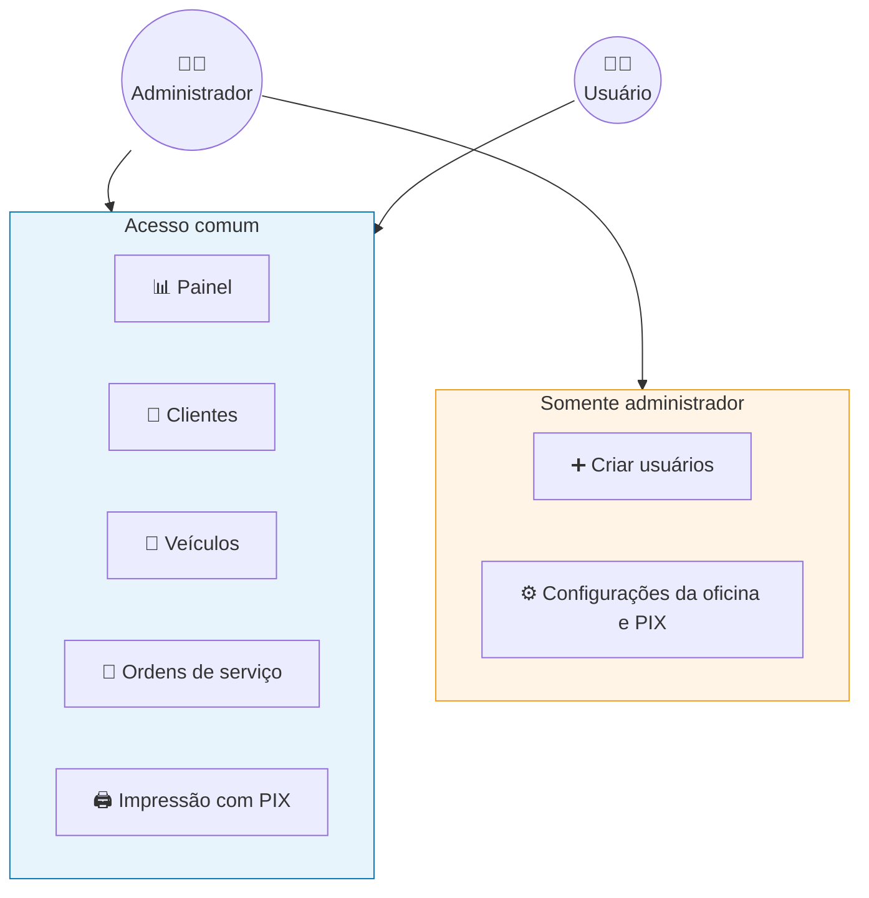
```mermaid
flowchart TB
    U(("🧑‍💼<br/>Administrador"))
    O(("🧑‍🔧<br/>Usuário"))

    subgraph Comum["Acesso comum"]
        P[📊 Painel]
        CL[👤 Clientes]
        VE[🚗 Veículos]
        OS[🧾 Ordens de serviço]
        IM[🖨️ Impressão com PIX]
    end

    subgraph Admin["Somente administrador"]
        US[➕ Criar usuários]
        CF[⚙️ Configurações da oficina e PIX]
    end

    U --> Comum
    U --> Admin
    O --> Comum

    style Admin fill:#fff4e5,stroke:#f0a020
    style Comum fill:#e8f4fb,stroke:#0B78B8
```

| Regra de segurança | Valor |
|---|---|
| Tamanho mínimo da senha | 8 caracteres |
| Exige | número, letra maiúscula, letra minúscula e caractere especial |
| Bloqueio de conta | após 5 tentativas erradas, por 15 minutos |
| Telas sem login | nenhuma, todas exigem autenticação |
| Primeiro administrador | criado automaticamente na primeira execução |

<br />

## 🏗️ Arquitetura

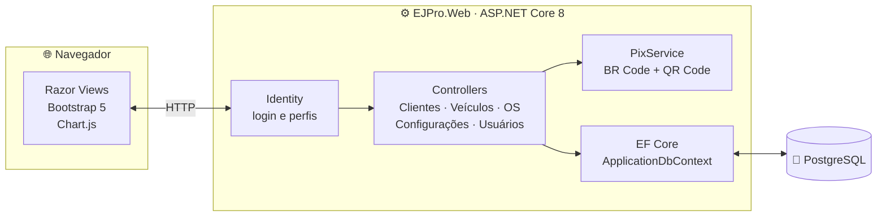
```mermaid
flowchart LR
    subgraph Navegador["🌐 Navegador"]
        UI[Razor Views<br/>Bootstrap 5<br/>Chart.js]
    end

    subgraph App["⚙️ EJPro.Web · ASP.NET Core 8"]
        direction TB
        AUTH[Identity<br/>login e perfis]
        CTRL[Controllers<br/>Clientes · Veículos · OS<br/>Configurações · Usuários]
        PIX[PixService<br/>BR Code + QR Code]
        EF[EF Core<br/>ApplicationDbContext]
    end

    DB[(🐘 PostgreSQL)]

    UI <-->|HTTP| AUTH
    AUTH --> CTRL
    CTRL --> PIX
    CTRL --> EF
    EF <--> DB
```

### Modelo de dados

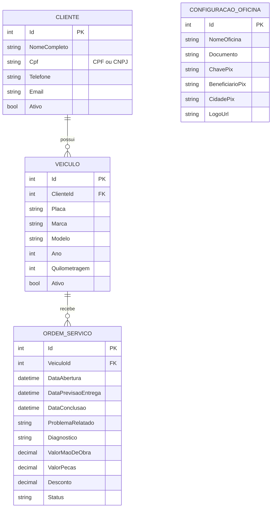
```mermaid
erDiagram
    CLIENTE ||--o{ VEICULO : possui
    VEICULO ||--o{ ORDEM_SERVICO : recebe

    CLIENTE {
        int Id PK
        string NomeCompleto
        string Cpf "CPF ou CNPJ"
        string Telefone
        string Email
        bool Ativo
    }

    VEICULO {
        int Id PK
        int ClienteId FK
        string Placa
        string Marca
        string Modelo
        int Ano
        int Quilometragem
        bool Ativo
    }

    ORDEM_SERVICO {
        int Id PK
        int VeiculoId FK
        datetime DataAbertura
        datetime DataPrevisaoEntrega
        datetime DataConclusao
        string ProblemaRelatado
        string Diagnostico
        decimal ValorMaoDeObra
        decimal ValorPecas
        decimal Desconto
        string Status
    }

    CONFIGURACAO_OFICINA {
        int Id PK
        string NomeOficina
        string Documento
        string ChavePix
        string BeneficiarioPix
        string CidadePix
        string LogoUrl
    }
```

O valor total da OS não fica gravado no banco. Ele é calculado na hora como `mão de obra + peças - desconto`, nunca ficando abaixo de zero.

### Estrutura de pastas

```text
ejpro-solucoes/
├── EJProSolucoes.sln
├── docs/
│   └── screenshots/              Imagens usadas neste README
└── EJPro.Web/
    ├── Areas/Identity/           Telas de login e cadastro
    ├── Controllers/              Clientes, Veículos, OS, Configurações, Usuários
    ├── data/                     DbContext e criação do administrador inicial
    ├── Migrations/               Histórico do banco (EF Core)
    ├── Models/                   Entidades e ViewModels
    ├── Services/                 PixService (BR Code e QR Code)
    ├── Views/                    Telas Razor
    ├── wwwroot/                  CSS, JS, imagens e bibliotecas
    ├── Dockerfile
    └── Program.cs
```

<br />

## 🛠️ Tecnologias

| Camada | Tecnologia | Uso no projeto |
|---|---|---|
| Back end | ASP.NET Core 8 MVC | Rotas, controllers e views |
| Autenticação | ASP.NET Core Identity | Login, perfis e política de senha |
| Banco de dados | PostgreSQL + Npgsql | Persistência de todos os cadastros |
| ORM | Entity Framework Core 8 | Mapeamento e migrations |
| Front end | Razor, Bootstrap 5.1 | Layout responsivo, tema claro e escuro |
| Gráficos | Chart.js 4.4 | Painel de situação e faturamento |
| PIX | QRCoder 1.8 | Geração da imagem do QR Code |
| Infra | Docker | Imagem pronta para homologação e produção |

<br />

## 🚀 Como rodar o projeto

### Pré-requisitos

- [.NET SDK 8](https://dotnet.microsoft.com/download/dotnet/8.0) ou superior
- [PostgreSQL](https://www.postgresql.org/download/) instalado localmente ou em um servidor
- Git

### 1. Clonar o repositório

```bash
git clone <url-do-repositorio>
cd ejpro-solucoes/EJPro.Web
```

### 2. Configurar a conexão e o administrador

As credenciais ficam fora do código, nos *User Secrets* do .NET. Rode os comandos abaixo dentro da pasta `EJPro.Web`, trocando os valores pelos seus:

```bash
dotnet user-secrets set "ConnectionStrings:DefaultConnection" "Host=localhost;Port=5432;Database=ejpro;Username=postgres;Password=SUA_SENHA"
dotnet user-secrets set "AdminInicial:Email" "admin@suaoficina.com.br"
dotnet user-secrets set "AdminInicial:Senha" "SenhaForte@2026"
```

> [!IMPORTANT]
> A senha do administrador precisa seguir a política do sistema: no mínimo 8 caracteres, com número, maiúscula, minúscula e caractere especial. Se não seguir, a aplicação não sobe e mostra o motivo no console.

### 3. Executar

```bash
dotnet run
```

Na primeira execução o sistema:

1. Cria o banco e aplica todas as migrations automaticamente
2. Cria os perfis `Administrador` e `Usuario`
3. Cria o administrador com o e-mail e a senha configurados

Depois é só abrir **http://localhost:5293** e entrar com o administrador.

<br />

## 🐳 Docker

O `Dockerfile` fica dentro de `EJPro.Web` e gera uma imagem enxuta, com build em duas etapas.

```bash
cd EJPro.Web
docker build -t ejpro-web .
```

```bash
docker run -d --name ejpro -p 8080:8080 \
  -e ConnectionStrings__DefaultConnection="Host=SEU_HOST;Port=5432;Database=ejpro;Username=postgres;Password=SUA_SENHA" \
  -e AdminInicial__Email="admin@suaoficina.com.br" \
  -e AdminInicial__Senha="SenhaForte@2026" \
  ejpro-web
```

A aplicação fica disponível em **http://localhost:8080**.

> [!TIP]
> Em variáveis de ambiente o `:` da configuração vira `__` (dois sublinhados). Por isso `AdminInicial:Email` vira `AdminInicial__Email`.

<br />

## 💡 Dicas de uso

> [!TIP]
> **Configure a oficina antes de tudo.** Em ⚙️ *Configurações*, preencha nome, CNPJ, telefone, endereço e os dados do PIX. Sem a chave PIX a OS é impressa normalmente, só que sem o QR Code.

> [!TIP]
> **Pesquise pelo que o cliente lembra.** O campo de busca das ordens aceita o número da OS, a placa, a marca, o modelo ou o nome do cliente, sem diferenciar maiúsculas de minúsculas.

> [!TIP]
> **Salve a OS em PDF.** Na tela de impressão, use o botão *Imprimir ou salvar como PDF* e escolha "Salvar como PDF" no navegador para mandar a OS pelo WhatsApp.

> [!TIP]
> **Use o tema escuro na bancada.** O ícone de lua no topo alterna entre claro e escuro, e a escolha fica salva no navegador.

> [!NOTE]
> Excluir um cliente ou veículo apenas inativa o registro. Cancelar uma OS muda a situação para *Cancelada*. Nada é apagado de verdade, então o histórico da oficina continua completo.

> [!WARNING]
> Nunca coloque a string de conexão ou a senha do administrador no `appsettings.json`. Use *User Secrets* no desenvolvimento e variáveis de ambiente no servidor.

<br />

## 🗺️ Histórico de evolução

| Período | Entrega |
|---|---|
| Set/2026 | Cadastro de clientes, veículos e ordens de serviço |
| Set/2026 | Login com perfis, pesquisa, filtros e paginação das OS |
| Set/2026 | Dockerfile e migrations aplicadas na inicialização |
| Out/2026 | Configurações da oficina e impressão da OS em uma página |
| Out/2026 | Tema claro e escuro, novo painel e menu lateral |
| Out/2026 | QR Code PIX e código copia e cola na impressão da OS |

<br />

<div align="center">

Feito com ☕ e 🔧 para a **E&J PRO Soluções**

<sub>Refrigeração automotiva com gestão de verdade.</sub>

</div>
